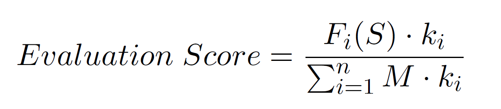

# Methodology

This chapter details the methodology for generating and evaluating realistic maritime radio distress calls using Large Language Models (LLMs). The approach adapts the Self-Instruct method to the maritime domain and uses parameter-efficient fine-tuning (LoRA, prompt tuning) to optimize Llama 3.1 8B for this task. All steps are specified for reproducibility.

---

## 1) Datasets

Multiple open-source datasets were used to generate realistic scenarios and context:

| Dataset Name                      | Source/Range/Version            | Fields Used                             | Notes                                          |
|------------------------------------|----------------------------------|-----------------------------------------|------------------------------------------------|
| GSHHG                             | L1, full resolution              | Polygon coordinates (land/sea)          | Distinguish land/sea; excludes Antarctica      |
| GeoNames                          | Downloaded 10/2024               | Name, lat/lon, feature code, country    | For nearest land features, ports, water bodies |
| Marine Cadastre AIS Data           | 01.01.2023–30.06.2024           | Vessel name, type, MMSI, call sign      | Vessel type mapping, deduplication, cleaning   |
| Danish Maritime Authority AIS Data | 26.07.2024–14.02.2025           | Vessel name, type, MMSI, call sign      | Type mapping to Marine Cadastre schema         |

**Vessel Data Preprocessing**:
- Remove vessels with missing names or “NO NAME”
- Nullify call signs with value “UNKNOWN”
- Standardize vessel types (see mapping table)
- Remove special characters and redundant whitespace
- Combine datasets, drop duplicates
- Randomly sample 5000 pleasure crafts & 5000 sailing vessels to reduce bias
- Final dataset: 58,855 unique vessels

| Vessel Type from Danish AIS data    | Vessel Type after the Conversion        |
|-------------------------------------|-----------------------------------------|
| Pleasure                           | Pleasure Craft                          |
| Sailing                            | Sailing Vessel                          |
| Cargo                              | Cargo Vessel                            |
| Fishing                            | Fishing Vessel                          |
| Towing                             | Towing Vessel                           |
| Towing long/wide                   | Towing Vessel                           |
| Passenger                          | Passenger Vessel                        |
| Tug                                | Tugboat                                 |
| Diving                             | Other                                   |
| Not party to conflict              | Other                                   |
| HSC                                | Other                                   |
| WIG                                | Other                                   |
| Spare 1                            | Other                                   |
| Spare 2                            | Other                                   |
| Reserved                           | Other                                   |
| Dredging                           | Other                                   |
| Undefined                          | Other                                   |
| SAR                                | Search and Rescue Vessel                |
| Law enforcement                    | Law Enforcement Vessel                  |
| Military                           | Military Vessel                         |
| Pilot                              | Pilot Vessel                            |
| Port tender                        | Port Tender                             |
| Anti-pollution                     | Anti Pollution Vessel                   |
| Medical                            | Medical Transport Vessel                |

**GeoNames Preprocessing**:  
Remove special characters and bracketed content from names.

---

## 2) Data Preprocessing

**Vessel Data**:
- Extract vessel name, type, MMSI, call sign
- Map type codes to human-readable types
- Ensure valid, non-null, standardized entries
- Combine and deduplicate

**GeoNames**:
- Filter to relevant feature codes (ISL, PRT, HBR, BAY, OCN, etc.)
- Used for extracting context (nearest land, port, harbor, water body, etc.)

---

## 3) LLM Used in the Study

Llama 3.1 8B is used in the project. Any model supported by the unsloth library can be used for LoRA.

---

## 4) Seed Chatters and SMCP Categories

The seed chatters are the foundation of the synthetic dataset. They are **manually created examples** that strictly comply with the IMO Standard Marine Communication Phrases (SMCP) Handbook.

### SMCP-Based Categories

Each seed chatter is assigned to one of **ten principal maritime distress categories** derived from the SMCP. These categories ensure coverage of the full range of SMCP maritime distress scenarios:

| SMCP Category             | Example Instruction                                                  |
|---------------------------|---------------------------------------------------------------------|
| Fire, Explosion           | Generate a maritime radio chatter. A vessel makes a distress call and reports a fire. |
| Flooding                  | Generate a maritime radio chatter. A vessel makes a distress call and reports flooding. |
| Collision                 | Generate a maritime radio chatter. A vessel makes a distress call and reports collision. |
| Grounding                 | Generate a maritime radio chatter. A vessel makes a distress call and reports grounding. |
| List, Danger of Capsizing | Generate a maritime radio chatter. A vessel makes a distress call and reports list-danger of capsizing. |
| Sinking                   | Generate a maritime radio chatter. A vessel makes a distress call and reports sinking. |
| Disabled, Adrift          | Generate a maritime radio chatter. A vessel makes a distress call and reports being disabled and adrift. |
| Armed Attack, Piracy      | Generate a maritime radio chatter. A vessel makes a distress call and reports armed attack/piracy. |
| Undesignated Distress     | Generate a maritime radio chatter. A vessel makes a distress call and reports an undesignated distress. |
| Person Overboard          | Generate a maritime radio chatter. A vessel makes a distress call and reports person overboard. |

### Use of SMCP Handbook Phrases

All seed chatters are **composed using the standard phraseology and structure from the SMCP handbook**. This means:
- Each chatter starts with “Mayday, Mayday, Mayday” as required.
- Compulsory information (vessel name, coordinates, distress type, etc.) is included in the order and format specified by SMCP.
- All radio exchanges use turn-taking and clarity as set by the SMCP, including the prescribed wording for Coast Guard and vessel responses.

### Realism and Coverage

- Each SMCP category contains **ten unique seed chatters**, for a total of 100 seed instances.
- Whenever applicable, **phrases from related SMCP categories are also included** to reflect real-life maritime communication, e.g., a “Sinking” chatter may reference a previous “Collision.”
- Seed chatters utilize vessel names and locations from real data sources, further grounding them in actual maritime context.

### Example:

> **Instruction:** Generate a maritime radio chatter. A vessel makes a distress call and reports a fire.
>
> **Chatter:**  
> "Mayday, Mayday, Mayday. This is cargo vessel COSCO KAOHSIUNG. I am located at three eight degrees three seven minutes North, one degrees three two point one five minutes East, five nautical miles south east of Isla de Formentera. I am on fire. Requesting fire fighting assistance immediately. Over."  
> "COSCO KAOHSIUNG, this is Coast Guard. Can you please provide information about the extent and the location of the fire? Over."  
> ...

### Purpose

These high-quality, SMCP-compliant, and category-specific seed chatters:
- Serve as the **primary exemplars** in the Self-Instruct pipeline,
- Anchor the generated dataset in **real-world maritime protocols**,
- Guide the LLM to produce outputs that are both **regulation-compliant and diverse**.

---

## 5) Self-Instruct for Maritime Distress Call Training Dataset Generation

This method is adapted to generate a large, diverse, and realistic set of maritime distress call training instances.

### Context Generation

For each synthetic instance:
- **Random Coordinate Generation**: Generate random maritime coordinates (lat/lon), check against GSHHG to ensure not on land. Exclude Antarctica.
- **Vessel Selection**: Random vessel from preprocessed dataset. MMSI and call sign set to null with certain probabilities. Vessel type normalized. `can_have_cargo` set based on vessel type.
- **Geospatial Analysis**: From GeoNames, extract:
  - Nearest land point (from GSHHG)
  - Closest place (island, populated place, etc.)
  - Closest port and harbor (within 200 NM)
  - Closest water body (bay, sea, ocean, etc.), checked for line-of-sight (no land in between)
  - Compute compass direction and distances
- **Coordinate Formatting**: Latitude/longitude converted to degrees-minutes (and optionally decimal) verbal format. “Digit by digit” format randomly chosen.
- **Collision Context**: For “collision” category, select a second vessel.

**Context Example**:

"vessel_name": "ARDMORE ENTERPRISE",
"vessel_MMSI": "five three eight zero zero five zero nine two",
"vessel_call_sign": "Victor seven Alfa Yankee two",
"vessel_type": "Tanker", "vessel_coordinate_lat": 63.11902894005475,
"vessel_coordinate_long": -63.19411473742137,
"vessel_coordinate_dms": [ "sixty-three degrees North", "sixty-three
degrees West" ],
"nearest_land_point_lat": 62.921639,
"nearest_land_point_long": -63.692556,
"distance_to_nearest_land": "eighteen",
"compass_direction": "north east",
"closest_place_name": "Lady Franklin Island", "closest_place_lat":
62.91716,
"closest_place_long": -63.69735,
"closest_place_feature_code": "ISL",
"distance_to_nearest_place": "eighteen",
"closest_place_country": "Canada",
"distance_to_nearest_port": "three hundred twenty-two",
"nearest_port": "Deception Bay Port",
"nearest_port_coordinates": [ 62.11883, -74.63151 ],
"distance_to_nearest_harbor": "twenty-eight",
"nearest_harbor": "Brevoort Harbour",
"nearest_harbor_coordinates": [ 63.31722, -64.1306 ],
"digit_by_digit": false,
"can_have_cargo": "True",
"closest_water_body": [ null ],
"closest_water_body_lat": [ null ],
"closest_water_body_long": [ null ],
"closest_water_body_distance": null

### Instance Generation

- **Prompt Construction**: LLM is prompted with category-specific instructions, requirements for valid distress calls, and 5 randomly selected example instances (3 seed, 2 synthetic) for diversity.
- **Prompt Example**:
  - Instruction (e.g., “Generate a maritime radio chatter. A vessel makes a distress call and reports a fire.”)
  - Example contexts and chatters

- **LLM Inference Hyperparameters**:
    - Temperature: 0.9
    - top_p: 0.9
    - top_k: 400
    - max_new_tokens: 400

- **Generation Process**: For each new context, generate a single new distress call for the context.

### Filtering

Instances generated in the previous step are subjected to numerous filters. Instances failing any filter are rejected. This process continues until 500 valid instances per category are collected.
Here is a comprehensive overview of all filters used in the synthetic maritime distress call generation:

| Filter Name                  | Explanation                                                                                           |
|------------------------------|-------------------------------------------------------------------------------------------------------|
| Parentheses                  | Rejects if any phrase is in parentheses; distress calls must not have text in parentheses.             |
| Bracket                      | Rejects if any phrase is in brackets; distress calls must not have text in brackets.                   |
| Mayday                       | Ensures the call starts with "Mayday, Mayday, Mayday" as required by SMCP.                             |
| Incomplete                   | Rejects if the output does not end with a dot; incomplete calls are not allowed.                       |
| Vessel Name Not After Mayday | Checks that vessel name appears directly after the "Mayday" phrase.                                    |
| Duplicate Sentences          | Rejects if any sentence longer than three words is repeated in the call.                               |
| No Coast Guard               | Rejects if the Coast Guard does not respond immediately in the conversation.                           |
| Digit by Digit               | If context flag is true, all numbers must be spoken digit by digit (e.g., "four five four").           |
| Wrong Category               | Ensures disaster category matches; checks for required keywords               |
| Unknown Information          | Rejects if phrases like "MMSI unknown" or "call sign None" are generated when these are null in context.|
| Vessel Name                  | Vessel name in context must appear in the distress call.                                               |
| Vessel MMSI                  | MMSI must be used if not null in context; must not appear if null.                                     |
| Vessel Call Sign             | Call sign must be used if not null in context; must not appear if null.                                |
| Vessel Type                  | Vessel type from context must appear in the call in correct format (e.g., "motor vessel X").           |
| Vessel Coordinate DMS        | Coordinates in DMS format from context must be present in the call.                                    |
| Hallucinated MMSI            | Rejects if LLM invents an MMSI number when none is in context.                                         |
| Hallucinated Call Sign       | Rejects if LLM invents a call sign when none is in context.                                            |
| False Cargo Logic            | If vessel cannot have cargo (flag false/null), chatter must not mention cargo.                         |
| Hallucinated Vessel Type     | Rejects if LLM invents or misstates vessel type, or says "I am a..." or "We are a...".                |
| Compass                      | If compass direction is mentioned, it must match the context.                                          |
| Both Port and Harbor         | If both are in context, only one may be used in the call.                                              |
| Distance to Nearest Port     | If distance to port is mentioned, it must match context value.                                         |
| Distance to Nearest Harbor   | If distance to harbor is mentioned, it must match context value.                                       |
| Distance to Closest Place    | If distance to closest place is mentioned, it must match context value.                                |
| Collided Vessel Name         | (Collision only) Must include collided vessel name if present in context.                              |
| Collided Vessel Type         | (Collision only) Must include collided vessel type if present in context.                              |
| Uniqueness                   | ROUGE-L similarity < 0.7 to any existing instance in pool; ensures originality.                        |
---

## 5) Fine-tuning the LLM with LoRA

**Low-Rank Adaptation (LoRA)** is used for parameter-efficient fine-tuning:
- LoRA adapters injected into all transformer layers (WQ, WV)
- Only 8.35% of model parameters (671M/8B) are trained per adapter set

| Parameter    | Value         |
|--------------|--------------|
| r (rank)     | 256          |
| Epochs       | 10           |
| Learning rate| 2e-4         |
| Optimizer    | AdamW        |
| Scheduler    | Linear, 30 warm-up steps |
| Batch size   | 2            |
| Grad. Accum. | 4            |
| Trained Params| 671M        |
| Model Params | 8B           |

- Separate LoRA adapters trained for each distress category
- Training format: instruction, context, and expected output (distress call)

---

## 6) Prompt Tuning the LLM

**Prompt tuning** optimizes a set of virtual tokens prepended to the prompt for each category:
- Model weights frozen; only virtual tokens (819,200 params, 0.01%) are trained

| Parameter           | Value      |
|---------------------|------------|
| Number of Tokens    | 200        |
| Epochs              | 50         |
| Learning rate       | 1e-2       |
| Optimizer           | AdamW      |
| Scheduler           | Linear     |
| Batch size          | 2          |
| Grad. Accum.        | 4          |
| Trained Params      | 819,200    |

- Separate token sets per category
- **Prompt Template**:

  Below is an instruction that describes a task, paired with an input that provides further context. Write a response that appropriately completes the request.
Instruction:
{Instruction}
Context:
{Context}
Maritime Radio Chatter:
plaintext
---

## 7) Evaluation of Distress Calls Generated by the Fine-tuned Adapters

**Four evaluation metrics**:

| Evaluation Criteria         | Filters Used                                                        | Coefficient |
|----------------------------|---------------------------------------------------------------------|-------------|
| **Correctness of the Format** | Parentheses                                                          | 1           |
|                            | Bracket                                                              | 1           |
|                            | Mayday                                                               | 1           |
|                            | Incomplete                                                           | 2           |
|                            | Vessel Name Not After Mayday                                         | 1           |
|                            | Duplicate Sentences                                                  | 2           |
|                            | No Coast Guard                                                       | 1           |
|                            | Digit by Digit                                                       | 1           |
| **Information Accuracy**    | Wrong Category                                                       | 2           |
|                            | Unknown Information                                                  | 1           |
|                            | Vessel Name                                                          | 2           |
|                            | Vessel MMSI                                                          | 2           |
|                            | Vessel Call Sign                                                     | 2           |
|                            | Vessel Type                                                          | 2           |
|                            | Vessel Coordinate DMS                                                | 2           |
|                            | Hallucinated MMSI                                                    | 1           |
|                            | Hallucinated Call Sign                                               | 1           |
|                            | False Cargo Logic                                                    | 1           |
|                            | Hallucinated Vessel Type                                             | 1           |
|                            | Compass                                                              | 2           |
|                            | Both Port and Harbor                                                 | 1           |
|                            | Distance to Nearest Port                                             | 1           |
|                            | Distance to Nearest Harbor                                           | 1           |
|                            | Distance to Closest Place                                            | 1           |
|                            | Collided Vessel Name (Collision only)                                | 2           |
|                            | Collided Vessel Type (Collision only)                                | 2           |
| **Uniqueness**              | Uniqueness (ROUGE-L similarity < 0.7 to any pool instance)          | 1           |

**Score Calculation:**

## Correctness of the Format and Information Accuracy

Let
- \( S \): a synthetic instance,
- \( F_i(S) \): the output of filter \( i \) for \( S \) (1 if passed, 0 if failed),
- \( k_i \): the coefficient (weight) for filter \( i \),
- \( M_i \): a binary mask (1 if the context value for filter \( i \) is not null, 0 otherwise),
- \( n \): the number of filters for the criterion.

**Score formula:**

---

## Uniqueness

The uniqueness metric evaluates how different a generated maritime distress call  is from all existing calls in the training dataset. For each generated call, the ROUGE-L similarity score between the generated call and every call in the training set is computed. The highest similarity (i.e., the closest match) is used to determine the uniqueness.

If the ROUGE-L similarity exceeds 0.7, the instance is considered not unique and receives a score of 0, otherwise the score is 1 - ROUGE-L similarity. 

**Evaluation Dataset:** 100 synthetic instances per category are generated and evaluated.

---

## 8) Limitations

- Quality limited by source datasets (vessel info, GeoNames)
- No Coast Guard station data; assumed reachable if ≤ 60 NM from land
- Seed instance creation may introduce author bias

---

**Summary:**  
This methodology enables the creation of a large, high-quality, and realistic dataset of maritime radio distress calls using open data, rigorous filtering, and resource-efficient LLM fine-tuning. The approach is modular and extensible to other domains.
