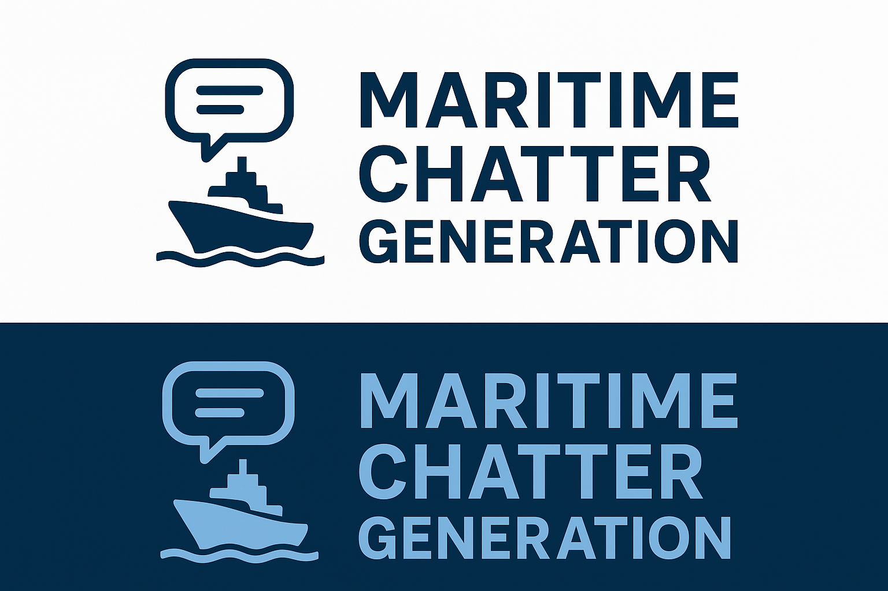

# Maritime Chatter Generation

Welcome to the Maritime Chatter Generation repository! This guide will help you set up, fine-tune and work with our synthetic maritime radio chatter generator.

## 📋 Project Overview

<!-- PROJECT LOGO -->
<br />
<div align="center">
  <a href="logos/logo-backup-hd.png">
    
  </a>
  <h3 align="center">Developed by <a href="https://github.com/Akdenizg"><strong>Gürsel Akdeniz</strong></a>
  <h4 align="center">Supervised by <a href="https://github.com/enakilci"><strong>Emin Nakilcioglu</strong></a>
  <p align="center">
    <br />
    <a href="#getting-started"><strong>Explore the docs »</strong></a>
    <br />
    <br />
    <a href="https://github.com/Akdenizg/maritime-chatter-generation/issues/new/choose">Report Bug</a> <!---report bug link to be added--->
    &middot;
    <a href="https://github.com/Akdenizg/maritime-chatter-generation/issues/new/choose">Request Feature</a> <!---request feature bug link to be added--->
  </p>
</div>

The maritime industry handles over 80% of global trade by volume, but safety is compromised by human errors. This project addresses the lack of open-source Automatic Speech Recognition (ASR) datasets for maritime radio communication by using Large Language Models (LLMs) to generate synthetic maritime distress calls, which can be converted to audio using Text-to-Speech systems.

We use **Llama 3.1 8B** with an adapted [Self-Instruct method](https://doi.org/10.48550/arXiv.2212.10560) to augment manually created seed instances. The model is fine-tuned using Low-Rank Adaptation (LoRA).

Evaluation metrics include format accuracy, information accuracy, and uniqueness.

📘 See `Methodology.md` for detailed technical information.

---

## 🚀 Getting Started

### Prerequisites

1. **Download Required Datasets:**
   - [GSHHG Dataset](https://www.soest.hawaii.edu/pwessel/gshhg/)
     - Place `GSHHS_shp/f/GSHHS_f_L1.shp` in `GSHHS_dataset/`
   - [GeoNames allCountries.zip](https://download.geonames.org/export/dump/)
     - Extract and place `allCountries.txt` in `all_countries/`

2. **Install Dependencies:**
   ```bash
   pip install -r requirements.txt
   ```

---

## 📁 Folder Structure

| Folder | Description |
|--------|-------------|
| `all_countries/` | GeoNames dataset (`allCountries.txt`) |
| `data/` | Vessel dataset and keyword filters |
| `evaluation/` | Evaluation results for different models |
| `experiments/` | Synthetic training data from Self-Instruct pipeline |
| `GSHHS_dataset/` | GSHHS coastline shapefiles |
| `models/` | Trained adapters (LoRA and prompt tuning) |
| `prompts/` | Instruction templates for Self-Instruct |
| `scripts/` | All Python scripts and Jupyter notebooks |
| `seed_outputs/` | Initial seed instances per SMCP category |
| `synthetic_chatters/` | Generated 100-sample chatter sets |

### Subfolder Organization

| Path | Content |
|------|---------|
| `evaluation/{task_name}` | LoRA adapter evaluations |
| `evaluation/prompt_tuning/{task_name}` | Prompt tuning evaluations |
| `models/{task_name}` | LoRA trained adapters |
| `models/prompt_tuning/{task_name}` | Prompt tuning adapters |
| `synthetic_chatters/{task_name}` | Chatters from LoRA model |
| `synthetic_chatters/prompt_tuning/{task_name}` | Chatters from prompt-tuned model |

---

## ⚙️ Script Overview & Usage

> 💡 **Before running:** Edit file paths and parameters at the top of each script!

### 1. Context Generation
```python
# geo_test.py
```
- **Purpose:** Generate geographical contexts and scenarios
- **Configuration:** Shapefile paths, GeoNames data, vessel data paths
- **Usage:** Called internally by other scripts

### 2. Data Generation
```python
# generate_instances.py
```
- **Purpose:** Run Self-Instruct pipeline to create synthetic training data
- **Configuration:** 
  - `land_shapefile`, `geonames_data_path`, `vessel_data_path`
  - `task_name`, `prompt_file`, LLM path, seed output path
  - Number of instances to generate
- **Order:** Run first (after preparing data/seed instances)
- **Output:** `experiments/{task_name}/`

### 3. LoRA Fine-Tuning
```python
# lora_finetune.ipynb
```
- **Purpose:** Fine-tune Llama 3.1 8B using LoRA
- **Configuration:** 
  - `model_dir` (base LLM)
  - `chatter_path` (from step 2)
  - `task_name`, hyperparameters
- **Order:** After `generate_instances.py`
- **Output:** `models/{task_name}/`

### 4. Generate Synthetic Chatters (LoRA)
```python
# run_models.py
```
- **Purpose:** Generate 100 new chatters using LoRA adapters
- **Configuration:** 
  - `hyperparameters_path` (from LoRA output)
  - File paths for input/output
- **Order:** After LoRA fine-tuning
- **Output:** `synthetic_chatters/{task_name}/`

### 5. Evaluate LoRA Results
```python
# inspect_model.py
```
- **Purpose:** Evaluate chatters generated by LoRA adapters
- **Configuration:** 
  - `keywords_path`, `ship_data_path`, `land_shapefile`
  - `geonames_data_path`, `seed_path`, `synthetic_chatter_path`
  - `save_dir`
- **Order:** After generating LoRA chatters
- **Output:** `evaluation/{task_name}/`

---

## 🔄 Execution Workflow

1. **Prepare Data**
   - Download and place GSHHG and GeoNames datasets
   - Prepare seed chatters in `seed_outputs/`

2. **Generate Training Data**
   ```bash
   python generate_instances.py
   ```

3. **Model Fine-Tuning**
   - Run `lora_finetune.ipynb`

4. **Generate Synthetic Chatters**
   - Run `python run_models.py`

5. **Evaluate Results**
   - Run `python inspect_model.py`

---
